

  

<h1 align="center"> IgnisBot  
  Robot autonome de détection et d’extinction de feu</h1>

  <b>Auteur : PAPUC Mihalache</b> 
  Étudiant en 2e année – Faculté d’Ingénierie en Langues Étrangères 
  Université Nationale de Science et Technologie POLITEHNICA de Bucarest  

<h1>
  DESCRIPTION
</h1>

  <b>IgnisBot est un robot mobile autonome conçu autour d’une carte microcontrôleur Arduino Uno. Il est spécifiquement développé pour la détection et l’extinction de foyers d’incendie localisés dans son champ d’action frontal.Le système repose sur trois capteurs de flamme disposés à l’avant du châssis, permettant une surveillance angulaire étendue. Lorsqu’un départ de feu est détecté, l’Arduino active automatiquement une pompe électrique, montée sur un bras motorisé (servo), capable de réaliser un balayage de 180° pour pulvériser de l’eau avec précision dans la zone ciblée. L’ensemble des composants (capteurs, actionneurs, pompe, relais) est intégré sur un châssis robotisé à 4 roues motrices, piloté via un module L298N. Cette configuration permet au robot de se déplacer de manière autonome vers la source de l’incendie, assurant une intervention mobile, rapide et localisée.</b>

<h1>
  MOTIVATION
</h1>

  La motivation derrière IgnisBot repose sur la montée des incendies liés au changement climatique, notamment dans les zones boisées, où les ressources d’intervention sont souvent insuffisantes. Ce robot symbolise une solution autonome de détection et de réaction face à un départ de feu, en illustrant le potentiel de la technologie embarquée dans des contextes critiques. Il constitue un outil d'apprentissage pour initier les étudiants à l’électronique, à la robotique mobile et à la programmation appliquée. En combinant utilité, apprentissage et conscience environnementale, IgnisBot représente une approche moderne de la formation par projet.

<h1>ARCHITECTURE</h1>

L'architecture d'IgnisBot repose sur une structure modulaire combinant détection, décision et action, organisée autour de la carte microcontrôleur Arduino Uno.

<h2>DIAGRAMME FONCTIONNEL</h2>

Ce diagramme montre les interactions principales entre les composants du robot.

  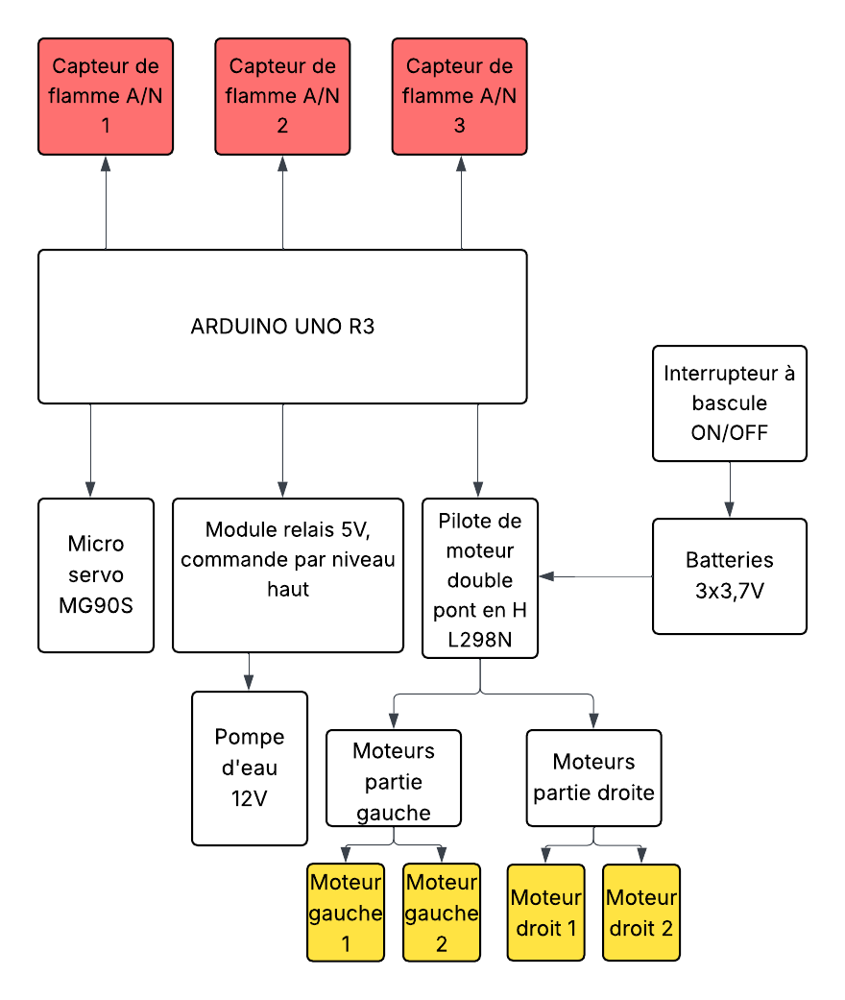

 

   Le diagramme fonctionnel présente de façon simplifiée l’architecture logique du système. Il permet de visualiser les fonctions principales du robot ainsi que les échanges d’informations entre les différents modules. Ce schéma joue un rôle clé pour comprendre comment chaque composant contribue à la mission du robot et comment l’ensemble coopère pour assurer un fonctionnement autonome et coordonné.
 

<h2>SCHÉMA ÉLECTRONIQUE</h2>

Le schéma suivant illustre les connexions électriques du projet

  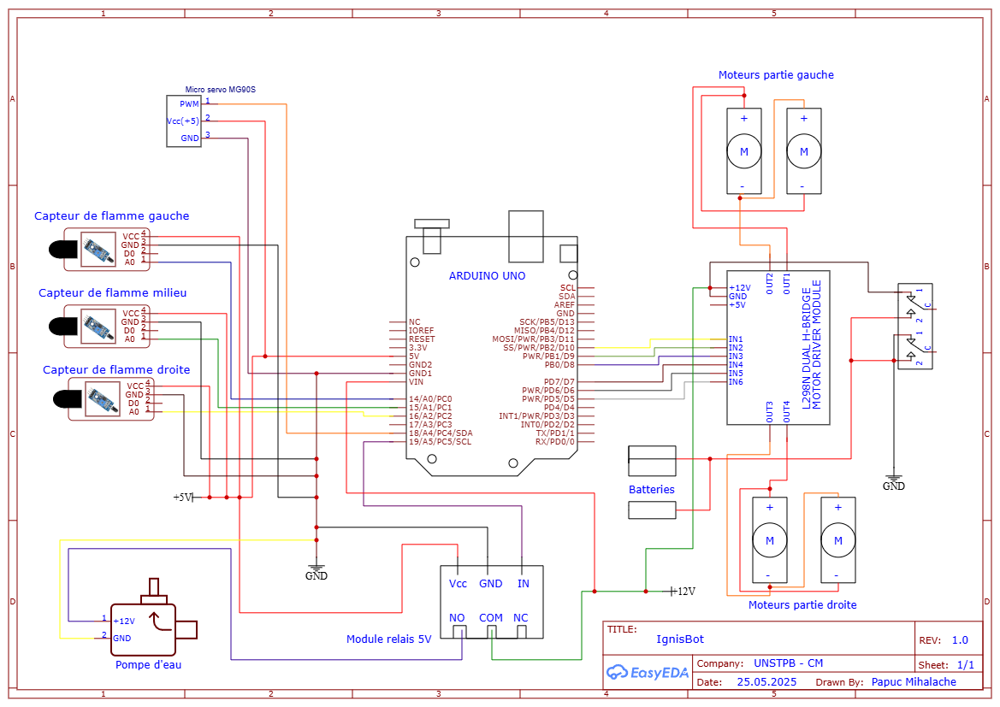

Le schéma électrique illustre le câblage réel de tous les composants du robot, en montrant les connexions entre la carte Arduino Uno, les capteurs de flamme, le servomoteur, les moteurs, le module L298N, la pompe, le relais et les sources d’alimentation. Il permet de visualiser précisément la circulation des signaux et de l’énergie dans le système. Ce schéma est essentiel pour assembler le robot correctement, et il constitue une base précieuse pour le prototypage, la maintenance ou la reproduction du projet.

<h1>COMPOSANTES ÉLECTRONIQUES</h1>

<table border="1" cellpadding="8" cellspacing="0">
  <thead>
    <tr>
      <th>Produit</th>
      <th>Quantité</th>
      <th>Prix unitaire (lei)</th>
      <th>Prix total (lei)</th>
      <th>Utilisation</th>
    </tr>
  </thead>
  <tbody>
    <tr>
      <td>Module pilote de moteur double L298N (rouge)</td>
      <td>1</td>
      <td>10,99</td>
      <td>10,99</td>
      <td>Contrôle de deux moteurs DC via Arduino Uno</td>
    </tr>
    <tr>
      <td>Breadboard (400 points)</td>
      <td>1</td>
      <td>4,56</td>
      <td>4,56</td>
      <td>Prototypage rapide des circuits sans soudure</td>
    </tr>
    <tr>
      <td>Kit de fils pour breadboard</td>
      <td>1</td>
      <td>7,99</td>
      <td>7,99</td>
      <td>Connexions entre composants sur la breadboard</td>
    </tr>
    <tr>
      <td>Fils dupont femelle-mâle (40 pièces, 20 cm)</td>
      <td>1</td>
      <td>7,99</td>
      <td>7,99</td>
      <td>Connexions entre capteurs, modules et microcontrôleur</td>
    </tr>
    <tr>
      <td>Support pour 2 piles 18650</td>
      <td>1</td>
      <td>3,99</td>
      <td>3,99</td>
      <td>Alimentation portable du robot</td>
    </tr>
    <tr>
      <td>Support individuel pour batterie 18650</td>
      <td>1</td>
      <td>1,73</td>
      <td>1,73</td>
      <td>Fixation d’une seule cellule 18650 pour extension</td>
    </tr>
    <tr>
      <td>Servomoteur MG90S</td>
      <td>1</td>
      <td>19,33</td>
      <td>19,33</td>
      <td>Orientation de la buse/pulvérisateur pour extinction</td>
    </tr>
    <tr>
      <td>Moteur avec réducteur et roue</td>
      <td>4</td>
      <td>14,99</td>
      <td>59,96</td>
      <td>Déplacement du robot</td>
    </tr>
    <tr>
      <td>Interrupteur marche/arrêt avec LED</td>
      <td>1</td>
      <td>1,99</td>
      <td>1,99</td>
      <td>Allumage/arrêt général du robot avec indicateur</td>
    </tr>
    <tr>
      <td>Câble USB AM-BM 50 cm pour Arduino MEGA/UNO</td>
      <td>1</td>
      <td>4,38</td>
      <td>4,38</td>
      <td>Programmation et alimentation via PC</td>
    </tr>
    <tr>
      <td>Capteur de flamme (analogique/numérique, 4 broches)</td>
      <td>3</td>
      <td>5,00</td>
      <td>15,00</td>
      <td>Détection des flammes dans l’environnement</td>
    </tr>
    <tr>
      <td>Tuyau pour pompe à eau 6x8 mm (2 mètres)</td>
      <td>2</td>
      <td>5,26</td>
      <td>10,52</td>
      <td>Acheminement de l’eau vers la sortie du système</td>
    </tr>
    <tr>
      <td>Pompe à eau/air R385 (6–12V, à diaphragme)</td>
      <td>1</td>
      <td>23,47</td>
      <td>23,47</td>
      <td>Extinction de feu via jet d’eau ou air</td>
    </tr>
    <tr>
      <td>Fils dupont femelle-femelle 20 cm</td>
      <td>1</td>
      <td>7,41</td>
      <td>7,41</td>
      <td>Connexion entre modules femelle (ex. capteur-capteur)</td>
    </tr>
    <tr>
      <td>Fils dupont mâle-mâle 30 cm</td>
      <td>2</td>
      <td>6,67</td>
      <td>13,34</td>
      <td>Connexions longues pour signaux ou alimentation</td>
    </tr>
    <tr>
      <td>Batteries 18650 (individuelles)</td>
      <td>3</td>
      <td>18,00</td>
      <td>54,00</td>
      <td>Source principale d’énergie (batteries rechargeables)</td>
    </tr>
    <tr>
      <td>Module relai 5V, commande High Level</td>
      <td>1</td>
      <td>5,50</td>
      <td>5,50</td>
      <td>Activation de la pompe ou autres charges via Arduino</td>
    </tr>
    <tr>
      <td>Supports métalliques en L</td>
      <td>2</td>
      <td>2,40</td>
      <td>4,80</td>
      <td>Fixation de la pompe et du réservoir d’eau</td>
    </tr>
  </tbody>
  <tfoot>
    <tr>
      <th colspan="3" style="text-align:right">Total général :</th>
      <th><strong>279,80 lei</strong></th>
      <th></th>
    </tr>
  </tfoot>
</table>

<h2>LIBRAIRIES UTILISÉES</h2>

<strong>Aucune bibliothèque externe n’a été utilisée dans ce projet.</strong>

<pre><code>// Exemple : aucun #include de type &lt;Servo.h&gt; ou &lt;NewPing.h&gt;
// Le servomoteur est contrôlé manuellement :
void servoPulse (int pin, int angle) {
  int pwm = (angle * 11) + 500; // Conversion de l’angle en microsecondes
  digitalWrite(pin, HIGH);
  delayMicroseconds(pwm);
  digitalWrite(pin, LOW);
  delay(50); // Cycle de rafraîchissement du servo
}
</code></pre>

Toutes les fonctionnalités du robot, telles que :
<ul>
  <li>la lecture des capteurs infrarouges (via <code>analogRead</code>),</li>
  <li>le déplacement via pont en H L298N (avec <code>digitalWrite</code>, <code>analogWrite</code>),</li>
  <li>le déclenchement de la pompe (via <code>digitalWrite</code>),</li>
  <li>et le balayage du servomoteur,</li>
</ul>
ont été <strong>implémentées sans utiliser de librairie Arduino externe</strong>.

<blockquote>
  Ce choix montre une compréhension approfondie du fonctionnement des composants électroniques,
  sans dépendre de bibliothèques préconstruites.
</blockquote>

<h1>JOURNAL DE BORD</h1>

<table border="1" cellpadding="8" cellspacing="0">
  <thead>
    <tr>
      <th>Semaine</th>
      <th>Période</th>
      <th>Activités réalisées</th>
    </tr>
  </thead>
  <tbody>
    <tr>
      <td>Semaine 1</td>
      <td>29 avril – 5 mai</td>
      <td>
        <ul>
          <li>Commande des premiers composants</li>
          <li>Étude des composants électroniques choisis</li>
          <li>Analyse des connexions entre capteurs, moteurs, servomoteurs et alimentation</li>
        </ul>
      </td>
    </tr>
    <tr>
      <td>Semaine 2</td>
      <td>6 – 12 mai</td>
      <td>
        <ul>
          <li>Montage matériel (hardware) de la première partie :</li>
          <ul>
            <li>Connexion des capteurs de flammes</li>
            <li>Installation des moteurs DC avec L298N</li>
            <li>Branchement et test du servomoteur MG90S</li>
          </ul>
          <li>Commande des composants restants pour la pompe à eau</li>
          <li>Début du codage pour les capteurs, moteurs et servo</li>
        </ul>
      </td>
    </tr>
    <tr>
      <td>Semaine 3</td>
      <td>13 – 19 mai</td>
      <td>
        <ul>
          <li>Assemblage final de la structure matérielle (hardware)</li>
          <li>Liaison complète de tous les composants (capteurs, relais, pompe, alimentation)</li>
          <li>Tests et mise en service de la pompe à eau</li>
          <li>Remodelage du châssis pour meilleure stabilité</li>
          <li>Finalisation de la partie logicielle (programme complet de détection et extinction)</li>
        </ul>
      </td>
    </tr>
    <tr>
      <td>Semaine 4</td>
      <td>20 – 26 mai</td>
      <td>
        <ul>
          <li>Touches finales du robot</li>
          <li>Fixation et organisation des câbles pour une reconnaissance facile et un aspect soigné</li>
          <li>Création des schémas techniques (électronique et fonctionnel)</li>
          <li>Rédaction et mise en page finale du projet</li>
        </ul>
      </td>
    </tr>
  </tbody>
</table>

<h2>SUIVI DU TEMPS DE TRAVAIL</h2>

Ce tableau présente la répartition des heures de travail estimées pour la réalisation complète du projet <strong>IgnisBot</strong>.

<table border="1" cellpadding="8" cellspacing="0">
  <thead>
    <tr>
      <th>Tâches réalisées</th>
      <th>Durée en heures</th>
    </tr>
  </thead>
  <tbody>
    <tr>
      <td>Recherche d’idées de conception sur Internet, analyse de projets similaires de robots pompiers</td>
      <td>3 h</td>
    </tr>
    <tr>
      <td>Étude de la détection de flamme et documentation sur les capteurs KY-026, les servomoteurs (pompe) et la carte Arduino</td>
      <td>3 h</td>
    </tr>
    <tr>
      <td>Commandes des composants et planification de l’architecture technique</td>
      <td>2 h</td>
    </tr>
    <tr>
      <td>Montage initial du châssis, installation des moteurs, supports, roues, connexion au L298N et test de direction</td>
      <td>4 h</td>
    </tr>
    <tr>
      <td>Installation et test des capteurs de flamme avec Arduino UNO</td>
      <td>3 h</td>
    </tr>
    <tr>
      <td>Programmation du système de balayage automatique avec servomoteur</td>
      <td>5 h</td>
    </tr>
    <tr>
      <td>Test de la pompe à eau, relais 5V, et pulvérisation directionnelle</td>
      <td>4 h</td>
    </tr>
    <tr>
      <td>Optimisation de la logique de détection + extinction ciblée</td>
      <td>4 h</td>
    </tr>
    <tr>
      <td>Fixation des câbles, ajout de supports métalliques, vérification esthétique</td>
      <td>3 h</td>
    </tr>
    <tr>
      <td>Création du schéma électronique et du diagramme fonctionnel</td>
      <td>3,5 h</td>
    </tr>
    <tr>
      <td>Documentation complète sur GitHub + rédaction du journal de bord</td>
      <td>3 h</td>
    </tr>
    <tr>
      <td>Photos finales, ajustements de la page et démo du projet</td>
      <td>3 h</td>
    </tr>
  </tbody>
  <tfoot>
    <tr>
      <th>Total d’heures travaillées :</th>
      <th><strong>45,5 heures</strong></th>
    </tr>
  </tfoot>
</table>

<h2>APERÇU DU CODE</h2>

<h3>Initialisation des broches</h3>

<ul>
  <li><strong>Capteurs de flamme :</strong>
    <ul>
      <li><code>ir_L</code>, <code>ir_F</code>, <code>ir_R</code> : capteurs infrarouges pour la gauche, l'avant et la droite.</li>
    </ul>
  </li>
  <li><strong>Contrôle des moteurs :</strong>
    <ul>
      <li><code>in1</code>, <code>in2</code>, <code>in3</code>, <code>in4</code> : broches de direction des moteurs gauche et droit.</li>
      <li><code>enA</code>, <code>enB</code> : PWM pour contrôler la vitesse des moteurs.</li>
    </ul>
  </li>
  <li><strong>Pompe :</strong>
    <ul>
      <li><code>pump</code> : broche pour activer la pompe à eau via relais 5V.</li>
    </ul>
  </li>
  <li><strong>Servomoteur :</strong>
    <ul>
      <li><code>servo</code> : contrôle du balayage gauche-droite (90° ↔ 180°).</li>
    </ul>
  </li>
</ul>

<h3>Contrôle des moteurs</h3>

<ul>
  <li>Le robot utilise deux moteurs DC pour avancer, reculer, tourner à gauche et à droite.</li>
  <li>La vitesse est définie par PWM (de 0 à 255). Dans ce projet, une valeur fixe <code>Speed = 160</code> est utilisée.</li>
  <li>Les fonctions <code>forword()</code>, <code>backword()</code>, <code>turnLeft()</code>, <code>turnRight()</code> assurent le mouvement.</li>
</ul>

<h3>Mode automatique</h3>

En <strong>mode automatique</strong>, le robot détecte les flammes à l’aide des capteurs infrarouges :

<ul>
  <li>Si un feu est détecté à droite (<code>ir_R</code>), la pompe s’active et le servomoteur balaie de 90° à 40°.</li>
  <li>Si la flamme est devant (<code>ir_F</code>), le robot stoppe et balaie toute la zone avec la pompe.</li>
  <li>Si elle est à gauche (<code>ir_L</code>), la pompe s’active avec balayage inversé.</li>
  <li>En absence de feu, il avance ou change de direction selon la position.</li>
</ul>

<h3>Lecture des capteurs</h3>

<ul>
  <li>Les capteurs sont lus avec <code>analogRead()</code> : si la valeur est &lt; 250, on considère qu’une flamme est détectée.</li>
  <li>Les résultats sont affichés sur le moniteur série pour le débogage.</li>
</ul>

<h1>GALERIE PHOTO</h1>

  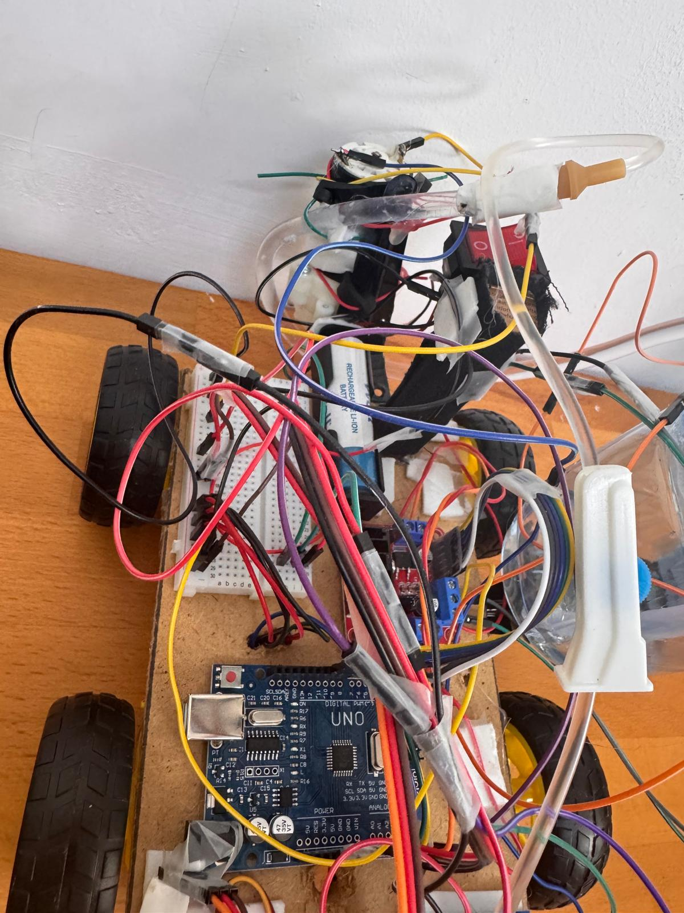
  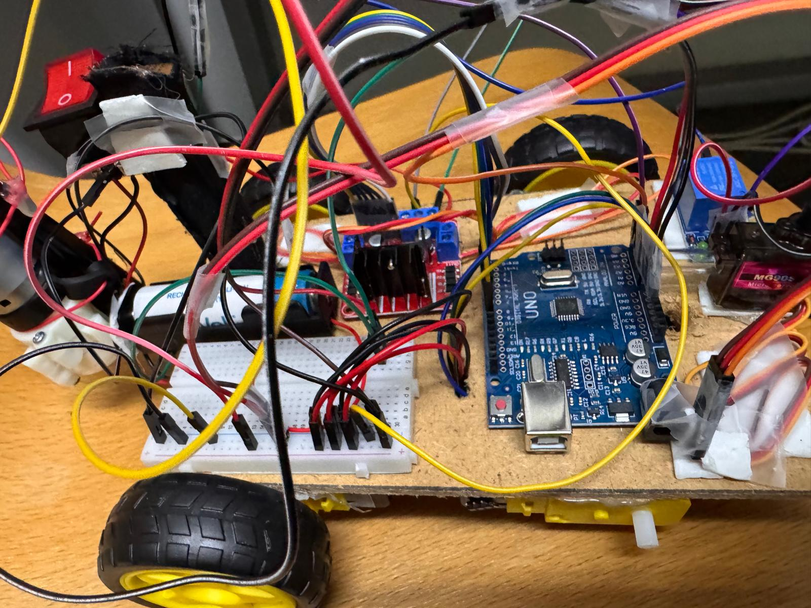
  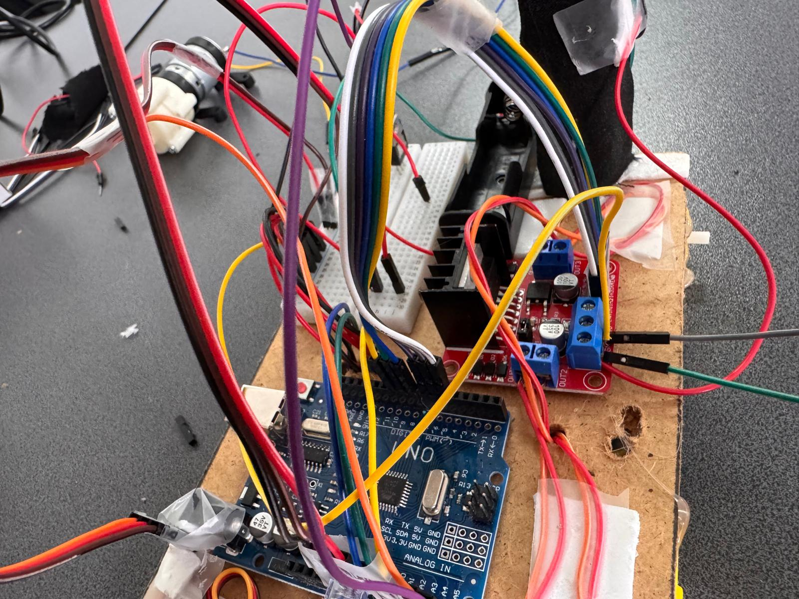
  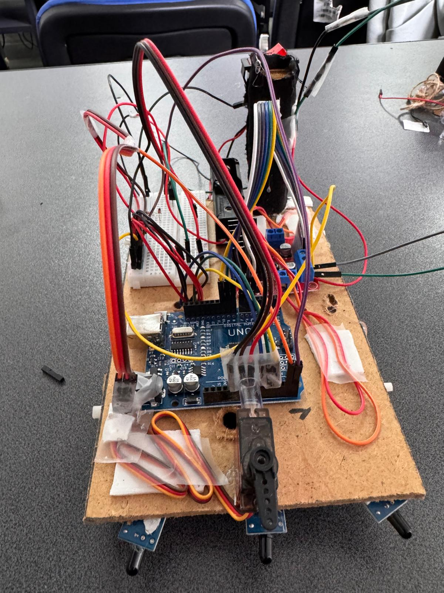
  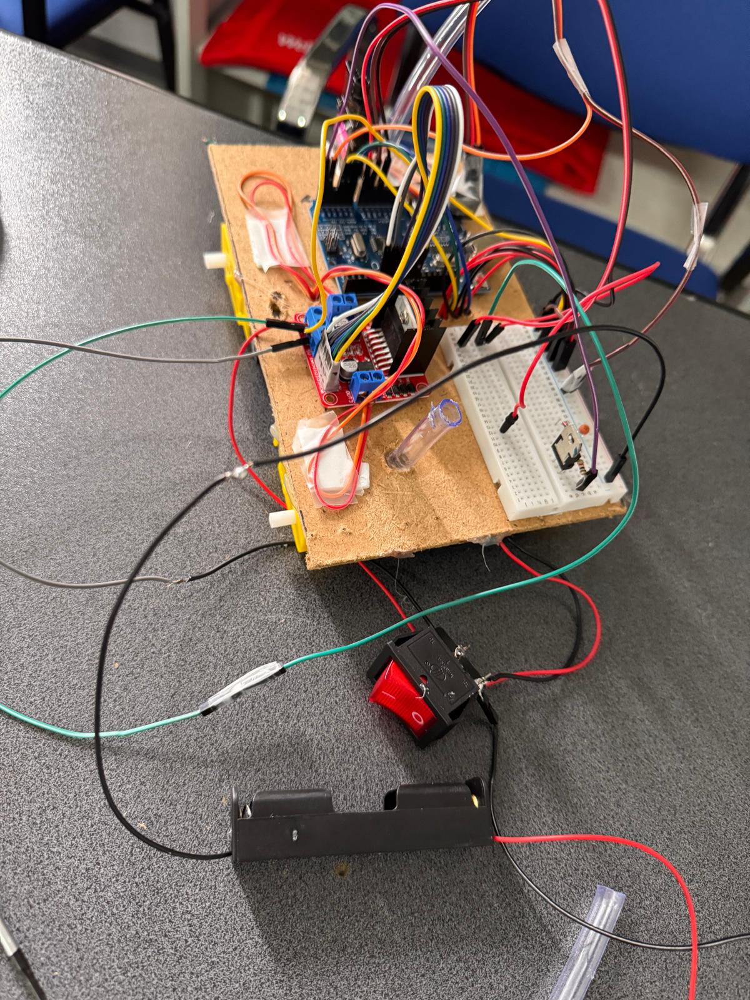
  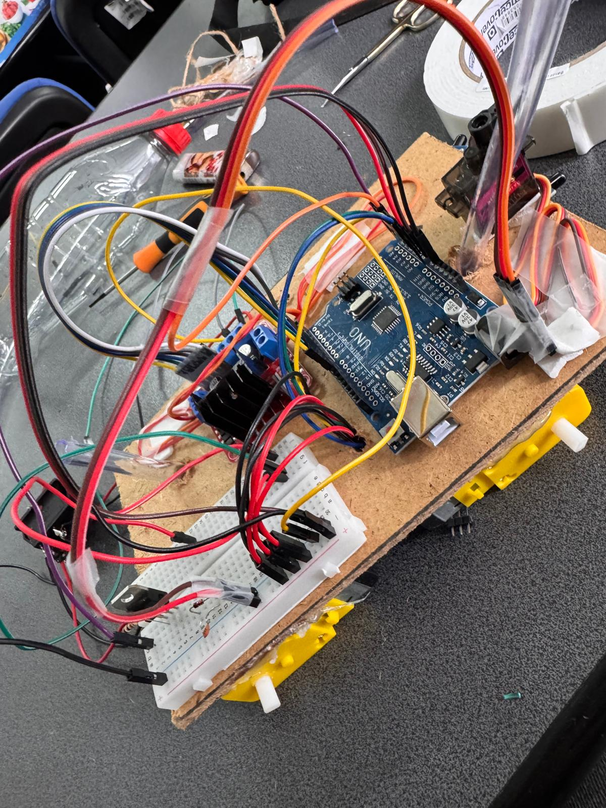
  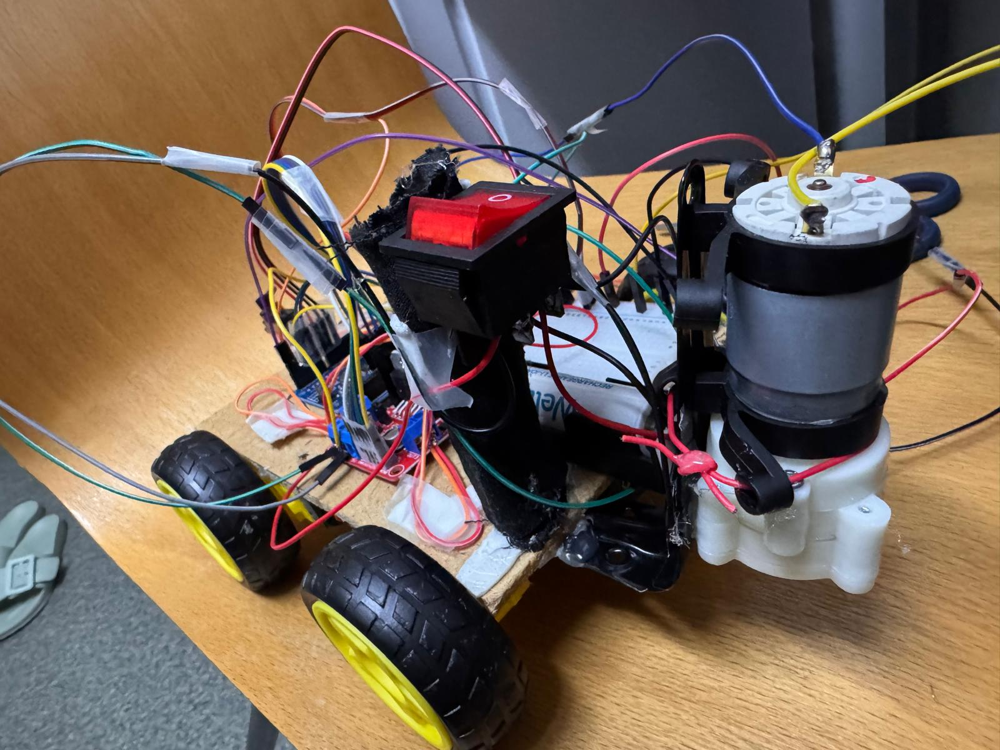
  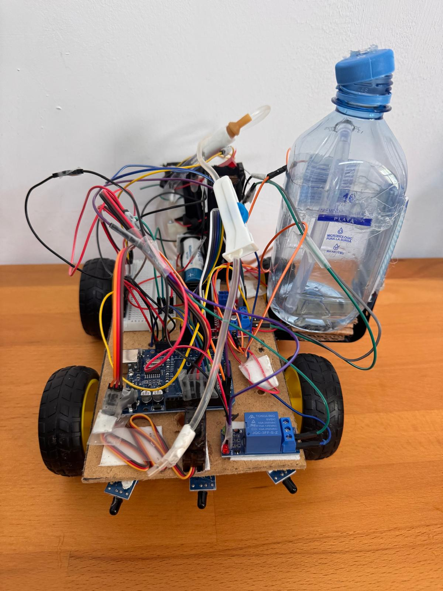
  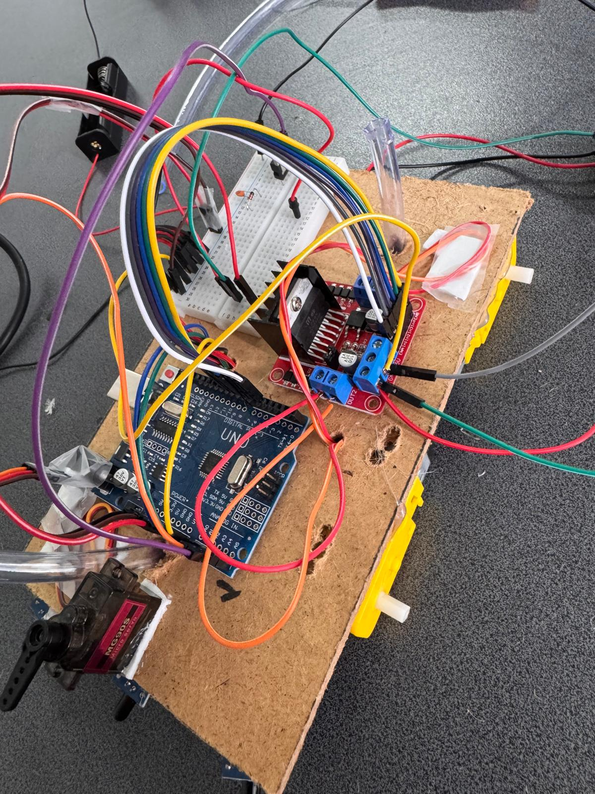
  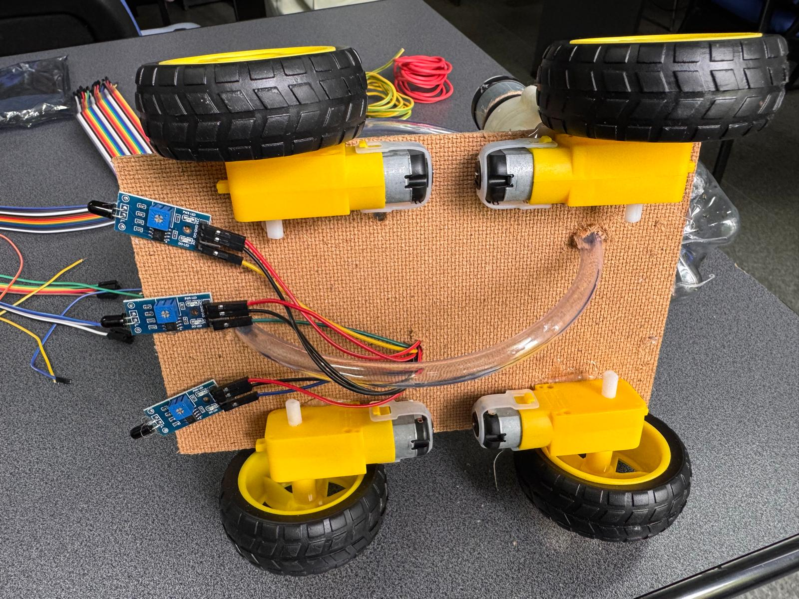

<h3>VIDÉO DE DÉMONSTRATION</h3>
[Télécharger IgnisBot_petitTesT.mp4](https://github.com/UPB-FILS-AM-FR/project-Papuc-Mihalache/raw/main/images/IgnisBot_petitTesT.mp4)

<h3>AMÉLIORATIONS FUTURES</h3>
<ul>
  <li>Ajout d’un module Bluetooth ou Wi-Fi pour contrôle manuel ou télémétrie</li>
  <li>Remplacement des capteurs IR par des capteurs de flamme plus précis (IR thermopile)</li>
  <li>Utilisation d’un écran LCD pour afficher les états et les alertes</li>
  <li>Passage à un microcontrôleur ESP32 pour plus de puissance et connectivité</li>
  <li>Ajout d’un capteur de température pour croiser les données de flamme</li>
</ul>

<h2>LIENS DE RÉFÉRENCE</h2>

<h3>Vidéos de démonstration de robots similaires</h3>
<ul>
  <li><a href="https://www.youtube.com/watch?v=_QzmknHTXfM" target="_blank">Détection automatique de feu et extinction – Projet robot</a></li>
  <li><a href="https://www.youtube.com/watch?v=jsvAL9ogFBw" target="_blank">Robot Firefighter – démonstration</a></li>
  <li><a href="https://www.youtube.com/watch?v=6rAVhszhOGw" target="_blank">Robot Fire Extinguisher – prototype avec pompe</a></li>
  <li><a href="https://www.youtube.com/watch?v=-9NscCoi6cY" target="_blank">Mini robot pompier contrôlé par capteurs</a></li>
</ul>

<h3>Tutoriels vidéo pour composants électroniques</h3>
<ul>
  <li><a href="https://www.youtube.com/watch?v=_I-7XYaAtAo" target="_blank">Comprendre les relais 5V – Tutoriel complet</a></li>
  <li><a href="https://www.youtube.com/watch?v=OZkZIP3KlHQ" target="_blank">Introduction au module L298N – Contrôle de moteurs DC</a></li>
</ul>

<h3>Fiches techniques officielles (Datasheets)</h3>
<ul>
  <li><a href="https://docs.arduino.cc/resources/datasheets/A000066-datasheet.pdf" target="_blank">Arduino UNO – Fiche technique officielle</a></li>
  <li><a href="https://mm.digikey.com/Volume0/opasdata/d220001/medias/docus/38/50200_Web.pdf" target="_blank">Pompe R385 – Spécifications techniques</a></li>
  <li><a href="https://www.electronicoscaldas.com/datasheet/MG90S_Tower-Pro.pdf" target="_blank">Servomoteur MG90S – Fiche technique</a></li>
  <li><a href="https://moviltronics.com/wp-content/uploads/2019/10/KY-026.pdf" target="_blank">Capteur de flamme KY-026 – Datasheet PDF</a></li>
  <li><a href="https://components101.com/sites/default/files/component_datasheet/5V%20Relay%20Datasheet.pdf" target="_blank">Relais 5V – Fiche technique détaillée</a></li>
  <li><a href="https://www.handsontec.com/dataspecs/L298N%20Motor%20Driver.pdf" target="_blank">L298N Motor Driver – Documentation PDF</a></li>
</ul>

